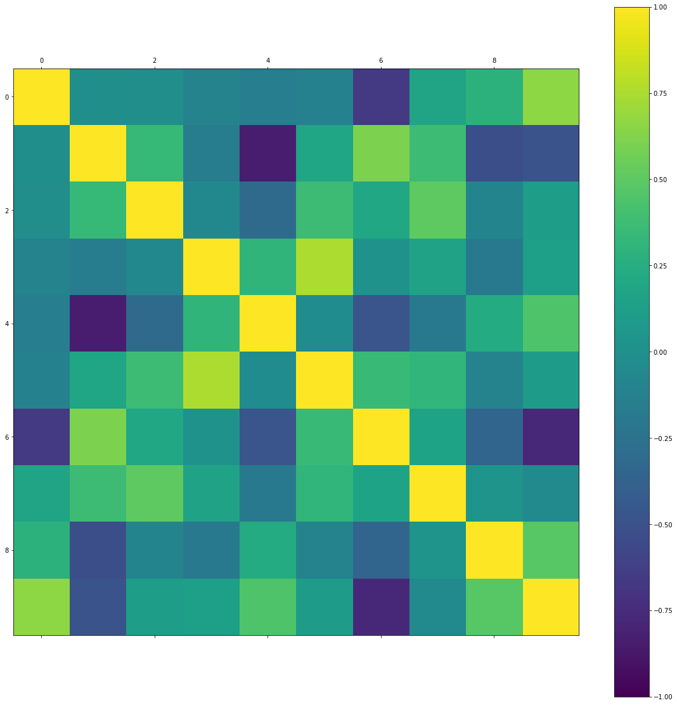
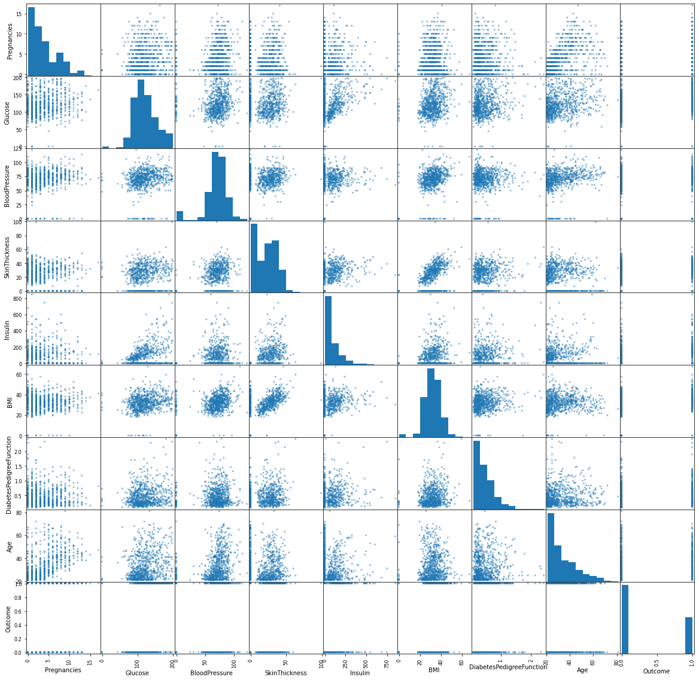

```python
import numpy as np
import pandas as pd
from matplotlib import  pyplot 
```


```python
df = pd.read_csv('diabetes.csv')
```


```python
df.shape
```


    (768, 9)


```python
df.head()
```


<div>
<style scoped>
    .dataframe tbody tr th:only-of-type {
        vertical-align: middle;
    }

    .dataframe tbody tr th {
        vertical-align: top;
    }

    .dataframe thead th {
        text-align: right;
    }
</style>
<table border="1" class="dataframe">
  <thead>
    <tr style="text-align: right;">
      <th></th>
      <th>Pregnancies</th>
      <th>Glucose</th>
      <th>BloodPressure</th>
      <th>SkinThickness</th>
      <th>Insulin</th>
      <th>BMI</th>
      <th>DiabetesPedigreeFunction</th>
      <th>Age</th>
      <th>Outcome</th>
    </tr>
  </thead>
  <tbody>
    <tr>
      <th>0</th>
      <td>6</td>
      <td>148</td>
      <td>72</td>
      <td>35</td>
      <td>0</td>
      <td>33.6</td>
      <td>0.627</td>
      <td>50</td>
      <td>1</td>
    </tr>
    <tr>
      <th>1</th>
      <td>1</td>
      <td>85</td>
      <td>66</td>
      <td>29</td>
      <td>0</td>
      <td>26.6</td>
      <td>0.351</td>
      <td>31</td>
      <td>0</td>
    </tr>
    <tr>
      <th>2</th>
      <td>8</td>
      <td>183</td>
      <td>64</td>
      <td>0</td>
      <td>0</td>
      <td>23.3</td>
      <td>0.672</td>
      <td>32</td>
      <td>1</td>
    </tr>
    <tr>
      <th>3</th>
      <td>1</td>
      <td>89</td>
      <td>66</td>
      <td>23</td>
      <td>94</td>
      <td>28.1</td>
      <td>0.167</td>
      <td>21</td>
      <td>0</td>
    </tr>
    <tr>
      <th>4</th>
      <td>0</td>
      <td>137</td>
      <td>40</td>
      <td>35</td>
      <td>168</td>
      <td>43.1</td>
      <td>2.288</td>
      <td>33</td>
      <td>1</td>
    </tr>
  </tbody>
</table>
</div>


```python
df.describe()
```


<div>
<style scoped>
    .dataframe tbody tr th:only-of-type {
        vertical-align: middle;
    }

    .dataframe tbody tr th {
        vertical-align: top;
    }

    .dataframe thead th {
        text-align: right;
    }
</style>
<table border="1" class="dataframe">
  <thead>
    <tr style="text-align: right;">
      <th></th>
      <th>Pregnancies</th>
      <th>Glucose</th>
      <th>BloodPressure</th>
      <th>SkinThickness</th>
      <th>Insulin</th>
      <th>BMI</th>
      <th>DiabetesPedigreeFunction</th>
      <th>Age</th>
      <th>Outcome</th>
    </tr>
  </thead>
  <tbody>
    <tr>
      <th>count</th>
      <td>768.000000</td>
      <td>768.000000</td>
      <td>768.000000</td>
      <td>768.000000</td>
      <td>768.000000</td>
      <td>768.000000</td>
      <td>768.000000</td>
      <td>768.000000</td>
      <td>768.000000</td>
    </tr>
    <tr>
      <th>mean</th>
      <td>3.845052</td>
      <td>120.894531</td>
      <td>69.105469</td>
      <td>20.536458</td>
      <td>79.799479</td>
      <td>31.992578</td>
      <td>0.471876</td>
      <td>33.240885</td>
      <td>0.348958</td>
    </tr>
    <tr>
      <th>std</th>
      <td>3.369578</td>
      <td>31.972618</td>
      <td>19.355807</td>
      <td>15.952218</td>
      <td>115.244002</td>
      <td>7.884160</td>
      <td>0.331329</td>
      <td>11.760232</td>
      <td>0.476951</td>
    </tr>
    <tr>
      <th>min</th>
      <td>0.000000</td>
      <td>0.000000</td>
      <td>0.000000</td>
      <td>0.000000</td>
      <td>0.000000</td>
      <td>0.000000</td>
      <td>0.078000</td>
      <td>21.000000</td>
      <td>0.000000</td>
    </tr>
    <tr>
      <th>25%</th>
      <td>1.000000</td>
      <td>99.000000</td>
      <td>62.000000</td>
      <td>0.000000</td>
      <td>0.000000</td>
      <td>27.300000</td>
      <td>0.243750</td>
      <td>24.000000</td>
      <td>0.000000</td>
    </tr>
    <tr>
      <th>50%</th>
      <td>3.000000</td>
      <td>117.000000</td>
      <td>72.000000</td>
      <td>23.000000</td>
      <td>30.500000</td>
      <td>32.000000</td>
      <td>0.372500</td>
      <td>29.000000</td>
      <td>0.000000</td>
    </tr>
    <tr>
      <th>75%</th>
      <td>6.000000</td>
      <td>140.250000</td>
      <td>80.000000</td>
      <td>32.000000</td>
      <td>127.250000</td>
      <td>36.600000</td>
      <td>0.626250</td>
      <td>41.000000</td>
      <td>1.000000</td>
    </tr>
    <tr>
      <th>max</th>
      <td>17.000000</td>
      <td>199.000000</td>
      <td>122.000000</td>
      <td>99.000000</td>
      <td>846.000000</td>
      <td>67.100000</td>
      <td>2.420000</td>
      <td>81.000000</td>
      <td>1.000000</td>
    </tr>
  </tbody>
</table>
</div>


```python
for column in df.columns:
    print(f"Column: {column}")
    print(f"Frequency:\n{df[column].value_counts()}\n")
    print(f"Mean: {df[column].mean()}")
    print(f"Median: {df[column].median()}")
    print(f"Mode:\n{df[column].mode()}")
    print(f"Variance: {df[column].var()}")
    print(f"Standard Deviation: {df[column].std()}")
    print(f"Skewness: {df[column].skew()}")
    print(f"Kurtosis: {df[column].kurt()}")
    print("----------\n")

```

    Column: Pregnancies
    Frequency:
    Pregnancies
    1     135
    0     111
    2     103
    3      75
    4      68
    5      57
    6      50
    7      45
    8      38
    9      28
    10     24
    11     11
    13     10
    12      9
    14      2
    15      1
    17      1
    Name: count, dtype: int64
    
    Mean: 3.8450520833333335
    Median: 3.0
    Mode:
    0    1
    Name: Pregnancies, dtype: int64
    Variance: 11.354056320621465
    Standard Deviation: 3.3695780626988694
    Skewness: 0.9016739791518588
    Kurtosis: 0.15921977754746486
    ----------
    
    Column: Glucose
    Frequency:
    Glucose
    99     17
    100    17
    111    14
    129    14
    125    14
           ..
    191     1
    177     1
    44      1
    62      1
    190     1
    Name: count, Length: 136, dtype: int64
    
    Mean: 120.89453125
    Median: 117.0
    Mode:
    0     99
    1    100
    Name: Glucose, dtype: int64
    Variance: 1022.2483142519557
    Standard Deviation: 31.97261819513622
    Skewness: 0.17375350179188992
    Kurtosis: 0.6407798203735053
    ----------
    
    Column: BloodPressure
    Frequency:
    BloodPressure
    70     57
    74     52
    78     45
    68     45
    72     44
    64     43
    80     40
    76     39
    60     37
    0      35
    62     34
    66     30
    82     30
    88     25
    84     23
    90     22
    86     21
    58     21
    50     13
    56     12
    52     11
    54     11
    75      8
    92      8
    65      7
    85      6
    94      6
    48      5
    96      4
    44      4
    100     3
    106     3
    98      3
    110     3
    55      2
    108     2
    104     2
    46      2
    30      2
    122     1
    95      1
    102     1
    61      1
    24      1
    38      1
    40      1
    114     1
    Name: count, dtype: int64
    
    Mean: 69.10546875
    Median: 72.0
    Mode:
    0    70
    Name: BloodPressure, dtype: int64
    Variance: 374.6472712271838
    Standard Deviation: 19.355807170644777
    Skewness: -1.8436079833551302
    Kurtosis: 5.180156560082496
    ----------
    
    Column: SkinThickness
    Frequency:
    SkinThickness
    0     227
    32     31
    30     27
    27     23
    23     22
    33     20
    28     20
    18     20
    31     19
    19     18
    39     18
    29     17
    40     16
    25     16
    26     16
    22     16
    37     16
    41     15
    35     15
    36     14
    15     14
    17     14
    20     13
    24     12
    42     11
    13     11
    21     10
    46      8
    34      8
    12      7
    38      7
    11      6
    43      6
    16      6
    45      6
    14      6
    44      5
    10      5
    48      4
    47      4
    49      3
    50      3
    8       2
    7       2
    52      2
    54      2
    63      1
    60      1
    56      1
    51      1
    99      1
    Name: count, dtype: int64
    
    Mean: 20.536458333333332
    Median: 23.0
    Mode:
    0    0
    Name: SkinThickness, dtype: int64
    Variance: 254.47324532811822
    Standard Deviation: 15.952217567727637
    Skewness: 0.10937249648187608
    Kurtosis: -0.520071866153013
    ----------
    
    Column: Insulin
    Frequency:
    Insulin
    0      374
    105     11
    130      9
    140      9
    120      8
          ... 
    73       1
    171      1
    255      1
    52       1
    112      1
    Name: count, Length: 186, dtype: int64
    
    Mean: 79.79947916666667
    Median: 30.5
    Mode:
    0    0
    Name: Insulin, dtype: int64
    Variance: 13281.180077955238
    Standard Deviation: 115.24400235133817
    Skewness: 2.272250858431574
    Kurtosis: 7.2142595543487715
    ----------
    
    Column: BMI
    Frequency:
    BMI
    32.0    13
    31.6    12
    31.2    12
    0.0     11
    32.4    10
            ..
    36.7     1
    41.8     1
    42.6     1
    42.8     1
    46.3     1
    Name: count, Length: 248, dtype: int64
    
    Mean: 31.992578124999998
    Median: 32.0
    Mode:
    0    32.0
    Name: BMI, dtype: float64
    Variance: 62.15998395738266
    Standard Deviation: 7.884160320375446
    Skewness: -0.42898158845356543
    Kurtosis: 3.290442900816981
    ----------
    
    Column: DiabetesPedigreeFunction
    Frequency:
    DiabetesPedigreeFunction
    0.258    6
    0.254    6
    0.268    5
    0.207    5
    0.261    5
            ..
    1.353    1
    0.655    1
    0.092    1
    0.926    1
    0.171    1
    Name: count, Length: 517, dtype: int64
    
    Mean: 0.47187630208333325
    Median: 0.3725
    Mode:
    0    0.254
    1    0.258
    Name: DiabetesPedigreeFunction, dtype: float64
    Variance: 0.1097786378731394
    Standard Deviation: 0.3313285950127749
    Skewness: 1.919911066307204
    Kurtosis: 5.5949535279830584
    ----------
    
    Column: Age
    Frequency:
    Age
    22    72
    21    63
    25    48
    24    46
    23    38
    28    35
    26    33
    27    32
    29    29
    31    24
    41    22
    30    21
    37    19
    42    18
    33    17
    38    16
    36    16
    32    16
    45    15
    34    14
    46    13
    43    13
    40    13
    39    12
    35    10
    50     8
    51     8
    52     8
    44     8
    58     7
    47     6
    54     6
    49     5
    48     5
    57     5
    53     5
    60     5
    66     4
    63     4
    62     4
    55     4
    67     3
    56     3
    59     3
    65     3
    69     2
    61     2
    72     1
    81     1
    64     1
    70     1
    68     1
    Name: count, dtype: int64
    
    Mean: 33.240885416666664
    Median: 29.0
    Mode:
    0    22
    Name: Age, dtype: int64
    Variance: 138.30304589037377
    Standard Deviation: 11.760231540678685
    Skewness: 1.1295967011444805
    Kurtosis: 0.6431588885398942
    ----------
    
    Column: Outcome
    Frequency:
    Outcome
    0    500
    1    268
    Name: count, dtype: int64
    
    Mean: 0.3489583333333333
    Median: 0.0
    Mode:
    0    0
    Name: Outcome, dtype: int64
    Variance: 0.22748261625380273
    Standard Deviation: 0.47695137724279896
    Skewness: 0.635016643444986
    Kurtosis: -1.600929755156027
    ----------
    


```python
from sklearn.linear_model import LinearRegression, LogisticRegression

```


```python
# Prepare the data
X_linear = df[['Glucose', 'BloodPressure', 'SkinThickness', 'Insulin', 'BMI', 'DiabetesPedigreeFunction', 'Age']]
y_linear = df['Outcome']

```


```python
# Fit the linear regression model
model_linear = LinearRegression()
model_linear.fit(X_linear, y_linear)
```


<style>#sk-container-id-1 {color: black;background-color: white;}#sk-container-id-1 pre{padding: 0;}#sk-container-id-1 div.sk-toggleable {background-color: white;}#sk-container-id-1 label.sk-toggleable__label {cursor: pointer;display: block;width: 100%;margin-bottom: 0;padding: 0.3em;box-sizing: border-box;text-align: center;}#sk-container-id-1 label.sk-toggleable__label-arrow:before {content: "▸";float: left;margin-right: 0.25em;color: #696969;}#sk-container-id-1 label.sk-toggleable__label-arrow:hover:before {color: black;}#sk-container-id-1 div.sk-estimator:hover label.sk-toggleable__label-arrow:before {color: black;}#sk-container-id-1 div.sk-toggleable__content {max-height: 0;max-width: 0;overflow: hidden;text-align: left;background-color: #f0f8ff;}#sk-container-id-1 div.sk-toggleable__content pre {margin: 0.2em;color: black;border-radius: 0.25em;background-color: #f0f8ff;}#sk-container-id-1 input.sk-toggleable__control:checked~div.sk-toggleable__content {max-height: 200px;max-width: 100%;overflow: auto;}#sk-container-id-1 input.sk-toggleable__control:checked~label.sk-toggleable__label-arrow:before {content: "▾";}#sk-container-id-1 div.sk-estimator input.sk-toggleable__control:checked~label.sk-toggleable__label {background-color: #d4ebff;}#sk-container-id-1 div.sk-label input.sk-toggleable__control:checked~label.sk-toggleable__label {background-color: #d4ebff;}#sk-container-id-1 input.sk-hidden--visually {border: 0;clip: rect(1px 1px 1px 1px);clip: rect(1px, 1px, 1px, 1px);height: 1px;margin: -1px;overflow: hidden;padding: 0;position: absolute;width: 1px;}#sk-container-id-1 div.sk-estimator {font-family: monospace;background-color: #f0f8ff;border: 1px dotted black;border-radius: 0.25em;box-sizing: border-box;margin-bottom: 0.5em;}#sk-container-id-1 div.sk-estimator:hover {background-color: #d4ebff;}#sk-container-id-1 div.sk-parallel-item::after {content: "";width: 100%;border-bottom: 1px solid gray;flex-grow: 1;}#sk-container-id-1 div.sk-label:hover label.sk-toggleable__label {background-color: #d4ebff;}#sk-container-id-1 div.sk-serial::before {content: "";position: absolute;border-left: 1px solid gray;box-sizing: border-box;top: 0;bottom: 0;left: 50%;z-index: 0;}#sk-container-id-1 div.sk-serial {display: flex;flex-direction: column;align-items: center;background-color: white;padding-right: 0.2em;padding-left: 0.2em;position: relative;}#sk-container-id-1 div.sk-item {position: relative;z-index: 1;}#sk-container-id-1 div.sk-parallel {display: flex;align-items: stretch;justify-content: center;background-color: white;position: relative;}#sk-container-id-1 div.sk-item::before, #sk-container-id-1 div.sk-parallel-item::before {content: "";position: absolute;border-left: 1px solid gray;box-sizing: border-box;top: 0;bottom: 0;left: 50%;z-index: -1;}#sk-container-id-1 div.sk-parallel-item {display: flex;flex-direction: column;z-index: 1;position: relative;background-color: white;}#sk-container-id-1 div.sk-parallel-item:first-child::after {align-self: flex-end;width: 50%;}#sk-container-id-1 div.sk-parallel-item:last-child::after {align-self: flex-start;width: 50%;}#sk-container-id-1 div.sk-parallel-item:only-child::after {width: 0;}#sk-container-id-1 div.sk-dashed-wrapped {border: 1px dashed gray;margin: 0 0.4em 0.5em 0.4em;box-sizing: border-box;padding-bottom: 0.4em;background-color: white;}#sk-container-id-1 div.sk-label label {font-family: monospace;font-weight: bold;display: inline-block;line-height: 1.2em;}#sk-container-id-1 div.sk-label-container {text-align: center;}#sk-container-id-1 div.sk-container {/* jupyter's `normalize.less` sets `[hidden] { display: none; }` but bootstrap.min.css set `[hidden] { display: none !important; }` so we also need the `!important` here to be able to override the default hidden behavior on the sphinx rendered scikit-learn.org. See: https://github.com/scikit-learn/scikit-learn/issues/21755 */display: inline-block !important;position: relative;}#sk-container-id-1 div.sk-text-repr-fallback {display: none;}</style><div id="sk-container-id-1" class="sk-top-container"><div class="sk-text-repr-fallback"><pre>LinearRegression()</pre><b>In a Jupyter environment, please rerun this cell to show the HTML representation or trust the notebook. <br />On GitHub, the HTML representation is unable to render, please try loading this page with nbviewer.org.</b></div><div class="sk-container" hidden><div class="sk-item"><div class="sk-estimator sk-toggleable"><input class="sk-toggleable__control sk-hidden--visually" id="sk-estimator-id-1" type="checkbox" checked><label for="sk-estimator-id-1" class="sk-toggleable__label sk-toggleable__label-arrow">LinearRegression</label><div class="sk-toggleable__content"><pre>LinearRegression()</pre></div></div></div></div></div>


```python
# Print the coefficients
print('Linear Regression Coefficients:')
for feature, coef in zip(X_linear.columns, model_linear.coef_):
    print(f'{feature}: {coef}')

```

    Linear Regression Coefficients:
    Glucose: 0.005932504680360903
    BloodPressure: -0.0022788371254208882
    SkinThickness: 0.00016697889986788398
    Insulin: -0.00020961695141379143
    BMI: 0.013310837289280066
    DiabetesPedigreeFunction: 0.13767815707868813
    Age: 0.005800684345071726


```python

# Make predictions
predictions_linear = model_linear.predict(X_linear)

```


```python
# Prepare the data
X_logistic = df[['Glucose', 'BloodPressure', 'SkinThickness', 'Insulin', 'BMI', 'DiabetesPedigreeFunction', 'Age']]
y_logistic = df['Outcome']
```


```python
# Fit the logistic regression model
model_logistic = LogisticRegression()
model_logistic.fit(X_logistic, y_logistic)

```


<style>#sk-container-id-3 {color: black;background-color: white;}#sk-container-id-3 pre{padding: 0;}#sk-container-id-3 div.sk-toggleable {background-color: white;}#sk-container-id-3 label.sk-toggleable__label {cursor: pointer;display: block;width: 100%;margin-bottom: 0;padding: 0.3em;box-sizing: border-box;text-align: center;}#sk-container-id-3 label.sk-toggleable__label-arrow:before {content: "▸";float: left;margin-right: 0.25em;color: #696969;}#sk-container-id-3 label.sk-toggleable__label-arrow:hover:before {color: black;}#sk-container-id-3 div.sk-estimator:hover label.sk-toggleable__label-arrow:before {color: black;}#sk-container-id-3 div.sk-toggleable__content {max-height: 0;max-width: 0;overflow: hidden;text-align: left;background-color: #f0f8ff;}#sk-container-id-3 div.sk-toggleable__content pre {margin: 0.2em;color: black;border-radius: 0.25em;background-color: #f0f8ff;}#sk-container-id-3 input.sk-toggleable__control:checked~div.sk-toggleable__content {max-height: 200px;max-width: 100%;overflow: auto;}#sk-container-id-3 input.sk-toggleable__control:checked~label.sk-toggleable__label-arrow:before {content: "▾";}#sk-container-id-3 div.sk-estimator input.sk-toggleable__control:checked~label.sk-toggleable__label {background-color: #d4ebff;}#sk-container-id-3 div.sk-label input.sk-toggleable__control:checked~label.sk-toggleable__label {background-color: #d4ebff;}#sk-container-id-3 input.sk-hidden--visually {border: 0;clip: rect(1px 1px 1px 1px);clip: rect(1px, 1px, 1px, 1px);height: 1px;margin: -1px;overflow: hidden;padding: 0;position: absolute;width: 1px;}#sk-container-id-3 div.sk-estimator {font-family: monospace;background-color: #f0f8ff;border: 1px dotted black;border-radius: 0.25em;box-sizing: border-box;margin-bottom: 0.5em;}#sk-container-id-3 div.sk-estimator:hover {background-color: #d4ebff;}#sk-container-id-3 div.sk-parallel-item::after {content: "";width: 100%;border-bottom: 1px solid gray;flex-grow: 1;}#sk-container-id-3 div.sk-label:hover label.sk-toggleable__label {background-color: #d4ebff;}#sk-container-id-3 div.sk-serial::before {content: "";position: absolute;border-left: 1px solid gray;box-sizing: border-box;top: 0;bottom: 0;left: 50%;z-index: 0;}#sk-container-id-3 div.sk-serial {display: flex;flex-direction: column;align-items: center;background-color: white;padding-right: 0.2em;padding-left: 0.2em;position: relative;}#sk-container-id-3 div.sk-item {position: relative;z-index: 1;}#sk-container-id-3 div.sk-parallel {display: flex;align-items: stretch;justify-content: center;background-color: white;position: relative;}#sk-container-id-3 div.sk-item::before, #sk-container-id-3 div.sk-parallel-item::before {content: "";position: absolute;border-left: 1px solid gray;box-sizing: border-box;top: 0;bottom: 0;left: 50%;z-index: -1;}#sk-container-id-3 div.sk-parallel-item {display: flex;flex-direction: column;z-index: 1;position: relative;background-color: white;}#sk-container-id-3 div.sk-parallel-item:first-child::after {align-self: flex-end;width: 50%;}#sk-container-id-3 div.sk-parallel-item:last-child::after {align-self: flex-start;width: 50%;}#sk-container-id-3 div.sk-parallel-item:only-child::after {width: 0;}#sk-container-id-3 div.sk-dashed-wrapped {border: 1px dashed gray;margin: 0 0.4em 0.5em 0.4em;box-sizing: border-box;padding-bottom: 0.4em;background-color: white;}#sk-container-id-3 div.sk-label label {font-family: monospace;font-weight: bold;display: inline-block;line-height: 1.2em;}#sk-container-id-3 div.sk-label-container {text-align: center;}#sk-container-id-3 div.sk-container {/* jupyter's `normalize.less` sets `[hidden] { display: none; }` but bootstrap.min.css set `[hidden] { display: none !important; }` so we also need the `!important` here to be able to override the default hidden behavior on the sphinx rendered scikit-learn.org. See: https://github.com/scikit-learn/scikit-learn/issues/21755 */display: inline-block !important;position: relative;}#sk-container-id-3 div.sk-text-repr-fallback {display: none;}</style><div id="sk-container-id-3" class="sk-top-container"><div class="sk-text-repr-fallback"><pre>LogisticRegression()</pre><b>In a Jupyter environment, please rerun this cell to show the HTML representation or trust the notebook. <br />On GitHub, the HTML representation is unable to render, please try loading this page with nbviewer.org.</b></div><div class="sk-container" hidden><div class="sk-item"><div class="sk-estimator sk-toggleable"><input class="sk-toggleable__control sk-hidden--visually" id="sk-estimator-id-3" type="checkbox" checked><label for="sk-estimator-id-3" class="sk-toggleable__label sk-toggleable__label-arrow">LogisticRegression</label><div class="sk-toggleable__content"><pre>LogisticRegression()</pre></div></div></div></div></div>


```python
# Print the coefficients
print('Logistic Regression Coefficients:')
for feature, coef in zip(X_logistic.columns, model_logistic.coef_[0]):
    print(f'{feature}: {coef}')


```

    Logistic Regression Coefficients:
    Glucose: 0.03454542972255705
    BloodPressure: -0.012209545050767769
    SkinThickness: 0.0010019923453049447
    Insulin: -0.0013499020344005905
    BMI: 0.08780999589220456
    DiabetesPedigreeFunction: 0.8191489032167988
    Age: 0.032695203605558366


```python
# Make predictions
predictions_logistic = model_logistic.predict(X_logistic)
```


```python
import statsmodels.api as sm
```


```python
pip install statsmodels 
```

    Defaulting to user installation because normal site-packages is not writeable
    Collecting statsmodels
      Downloading statsmodels-0.14.0-cp310-cp310-manylinux_2_17_x86_64.manylinux2014_x86_64.whl (10.1 MB)
         ━━━━━━━━━━━━━━━━━━━━━━━━━━━━━━━━━━━━━━━━ 10.1/10.1 MB 1.8 MB/s eta 0:00:00m eta 0:00:0136m0:00:010m
    [?25hRequirement already satisfied: numpy>=1.18 in /usr/lib/python3/dist-packages (from statsmodels) (1.21.5)
    Requirement already satisfied: scipy!=1.9.2,>=1.4 in /usr/lib/python3/dist-packages (from statsmodels) (1.8.0)
    Requirement already satisfied: pandas>=1.0 in /home/yashraj/.local/lib/python3.10/site-packages (from statsmodels) (2.0.3)
    Collecting patsy>=0.5.2 (from statsmodels)
      Downloading patsy-0.5.3-py2.py3-none-any.whl (233 kB)
         ━━━━━━━━━━━━━━━━━━━━━━━━━━━━━━━━━━━━━━━ 233.8/233.8 kB 1.5 MB/s eta 0:00:00 MB/s eta 0:00:01:01
    [?25hRequirement already satisfied: packaging>=21.3 in /usr/lib/python3/dist-packages (from statsmodels) (21.3)
    Requirement already satisfied: python-dateutil>=2.8.2 in /home/yashraj/.local/lib/python3.10/site-packages (from pandas>=1.0->statsmodels) (2.8.2)
    Requirement already satisfied: pytz>=2020.1 in /usr/lib/python3/dist-packages (from pandas>=1.0->statsmodels) (2022.1)
    Requirement already satisfied: tzdata>=2022.1 in /home/yashraj/.local/lib/python3.10/site-packages (from pandas>=1.0->statsmodels) (2023.3)
    Requirement already satisfied: six in /usr/lib/python3/dist-packages (from patsy>=0.5.2->statsmodels) (1.16.0)
    Installing collected packages: patsy, statsmodels
    Successfully installed patsy-0.5.3 statsmodels-0.14.0
    
    [notice] A new release of pip is available: 23.2.1 -> 23.3
    [notice] To update, run: python3 -m pip install --upgrade pip
    Note: you may need to restart the kernel to use updated packages.


```python
# Split the dataset into the independent variables (X) and the dependent variable (y)
X = df.drop('Outcome', axis=1)  # Independent variables
y = df['Outcome']  # Dependent variable

```


```python
# Add a constant column to the independent variables
X = sm.add_constant(X)
```


```python
# Fit the multiple regression model
model = sm.OLS(y, X)
results = model.fit()
```


```python
# Print the regression results
print(results.summary())
```

                                OLS Regression Results                            
    ==============================================================================
    Dep. Variable:                Outcome   R-squared:                       0.303
    Model:                            OLS   Adj. R-squared:                  0.296
    Method:                 Least Squares   F-statistic:                     41.29
    Date:                Thu, 19 Oct 2023   Prob (F-statistic):           7.36e-55
    Time:                        15:15:12   Log-Likelihood:                -381.91
    No. Observations:                 768   AIC:                             781.8
    Df Residuals:                     759   BIC:                             823.6
    Df Model:                           8                                         
    Covariance Type:            nonrobust                                         
    ============================================================================================
                                   coef    std err          t      P>|t|      [0.025      0.975]
    --------------------------------------------------------------------------------------------
    const                       -0.8539      0.085     -9.989      0.000      -1.022      -0.686
    Pregnancies                  0.0206      0.005      4.014      0.000       0.011       0.031
    Glucose                      0.0059      0.001     11.493      0.000       0.005       0.007
    BloodPressure               -0.0023      0.001     -2.873      0.004      -0.004      -0.001
    SkinThickness                0.0002      0.001      0.139      0.890      -0.002       0.002
    Insulin                     -0.0002      0.000     -1.205      0.229      -0.000       0.000
    BMI                          0.0132      0.002      6.344      0.000       0.009       0.017
    DiabetesPedigreeFunction     0.1472      0.045      3.268      0.001       0.059       0.236
    Age                          0.0026      0.002      1.693      0.091      -0.000       0.006
    ==============================================================================
    Omnibus:                       41.539   Durbin-Watson:                   1.982
    Prob(Omnibus):                  0.000   Jarque-Bera (JB):               31.183
    Skew:                           0.395   Prob(JB):                     1.69e-07
    Kurtosis:                       2.408   Cond. No.                     1.10e+03
    ==============================================================================
    
    Notes:
    [1] Standard Errors assume that the covariance matrix of the errors is correctly specified.
    [2] The condition number is large, 1.1e+03. This might indicate that there are
    strong multicollinearity or other numerical problems.


```python
import numpy as np
import matplotlib.pyplot as plt

# Define a sample correlation matrix (you should replace this with your data)
corr = np.corrcoef(np.random.rand(10, 10))

fig = plt.figure()
ax = fig.add_subplot(111)
cax = ax.matshow(corr, vmin=-1, vmax=1)
fig.colorbar(cax)
ticks = np.arange(0, 10, 1)

plt.show()

```


    

    


```python
from pandas.plotting import scatter_matrix
pyplot.rcParams['figure.figsize'] = [20, 20]
scatter_matrix(df)
pyplot.show()
```


    

    

